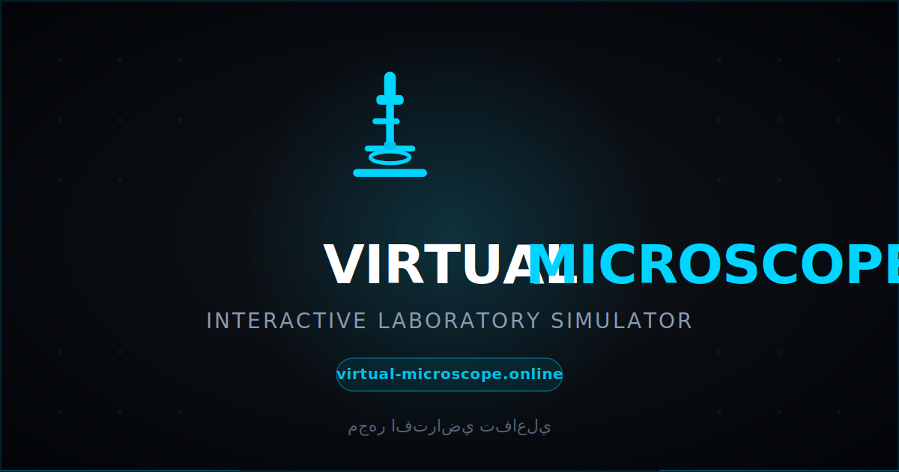

<div align="center">

# Virtual Microscope

### An interactive, browser-based laboratory microscope simulator for medical and biology education

[](https://virtual-microscope.online)
[](https://github.com/ia7mad/Virtual-Microscope)
[](#internationalization)
[](#tech-stack)

**[Open the live demo &rarr;](https://virtual-microscope.online)**

<br>



</div>

---

## What it is

A faithful simulation of a clinical light microscope, optimised for teaching.

Hand a phone, tablet, or laptop to anyone — they immediately know what to do: a round eyepiece with a real specimen image inside, three objective lenses to switch between, coarse + fine focus dials, a lamp brightness knob, drag-to-pan, and a one-tap **Identify Structures** mode that labels what they're looking at.

The whole thing is **one HTML file with no build step**. Open it from a USB stick on the showcase laptop and it works.

## Highlights

| | |
|---|---|
| **Three objective lenses** | 10x Low Power · 40x High Power · 100x Oil Immersion, with a real "clunk" sound and turret-shadow sweep on every change. |
| **Dual-knob focus** | Outer coarse ring + inner fine knob, mirroring a real microscope, with synthesised dial-click sounds (no audio files). |
| **Lamp brightness** | Dial + slider (20 %–200 %), driving a real CSS filter on the slide. |
| **Identify Structures** | Tap once to overlay labelled markers for every structure on the current sample. |
| **Mini-map + scale bar** | Bottom-left mini-map shows the whole slide with viewport rectangle; bottom-right scale bar (100 µm / 25 µm / 10 µm) updates per lens. |
| **Bilingual UI** | Full English + Arabic with proper RTL layout. |
| **Mobile-tuned zoom** | A viewport-aware zoom factor (0.55x on screens ≤ 768 px) so 10x reads as a true low-power view on phones, not a punched-in 40x. |
| **Guided tour** | Scripted walkthrough of every control (desktop only — overlay would block the lens on small screens). |

## Specimen library

Eight specimens ship by default, each with English + Arabic name, description, and labelled markers:

`Normal Blood` · `Malaria Infection` · `Onion Root Cells (mitosis)` · `Gram-stained bacteria` · `Urine crystals` · `Histopathology section` · `Stool examination` · `Semen analysis`

Plus extra clinical cases: blood schistocytes, sickle cell, urine calcium oxalate, urine yeast.

Specimens are stored in **Supabase Storage** and fetched at load time, with the bundled [assets/](assets/) acting as fallback.

## Tech stack

- **Vanilla HTML / CSS / JavaScript** — no framework, no bundler.
- **Web Audio API** — synthesised dial-click and lens-change sounds.
- **Supabase** — live specimen list + admin curator panel.
- **GitHub Pages** — static hosting on `virtual-microscope.online` via the [CNAME](CNAME) file.

The whole runtime is a single ~5 700-line [index.html](index.html). Keeping it monolithic is deliberate: the showcase laptop must be able to open the file with zero dependencies.

## Quick start

```bash
git clone https://github.com/ia7mad/Virtual-Microscope.git
cd Virtual-Microscope
python -m http.server 8000
```

Open <http://localhost:8000>. That's the whole setup.

## File layout

```
Virtual-Microscope/
├── index.html        Main app (HTML + CSS + JS in one file)
├── admin.html        Curator panel for editing specimens
├── PROJECT.md        Full technical documentation
├── README.md         This file
├── CNAME             virtual-microscope.online
├── gen_qr.py         Generates the showcase QR-code SVG
├── preview.svg       Social-share preview (used as hero above)
├── qr-showcase.svg   QR code for the showcase poster
└── assets/           Specimen images (PNG)
    └── cases/        Extra clinical cases
```

## Documentation

For the deep dive — architecture diagram, every responsive regime, the iOS-Safari workarounds, the lens-change pipeline, and the Supabase schema — see **[PROJECT.md](PROJECT.md)**.

## Internationalization

The whole UI is bilingual (English + Arabic). Language is toggled via `body.lang-en` / `body.lang-ar` classes; CSS rules under each class flip text direction, font, alignment, and component spacing. Specimen content carries `{ en, ar }` objects.

## Credits

Created by **Ahmed · Hussin · Mohammed**.

[](https://wa.me/966550905017)
